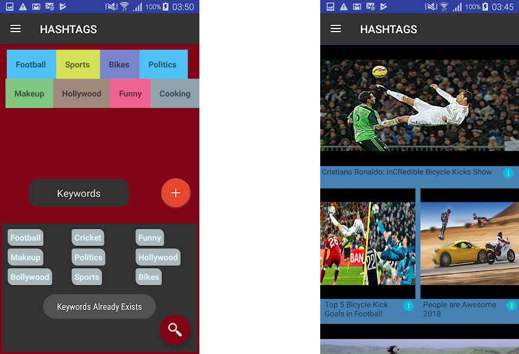

# HashtagVideo

### Videos and Videos

  - Create your own favourite examples list and enjoy results from millions of youtube videos.
  - Enjoy a collection of new videos every time based on your favourite topics and words
  

# Motive
A Personal project started alongside an internship. The project was used to practice my android development skills with an objective to try new libraries, architechture patterns and design ideas.

## Libraries Employed
- RecyclerViewTools
- YouTubeAndroidPlayerApi
- Realm Database
- taggeredTextGridView library 
- markushi circlebutton library (Depreciated)
